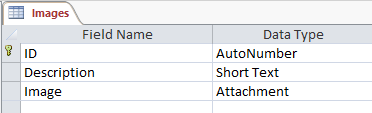

# Image Database Viewer

## Solutions



There are quite a few problems displaying an image from an AccessDB in a DataGridView, this was a bit of a challenge.

Please see below for an explanation & solution for each.

In theory you can do the same with a MySQL "Blob", if the blob can be read as a `byte[]`.

### 1 - Accessing the Image Itself

If you query the database like this, you only get the name of the image back, not the image itself:

```sql
SELECT ID, Description, Image
FROM Images
```

The solution is to access the FileData; this returns a byte array you can convert into an image for display

```sql
SELECT ID, Description, Image.FileName, Image.FileData 
FROM Images
```

### 2 - Converting the Byte[] into an Image

The `DataGridView` has no idea how to show the `byte[]` type in the table

So if you use a `DataBindingSource` you get an error as it cannot convert the type.

What you can do is bind to the `DataGridView_CellFormatting` event, this is called whenever a value is passed to a row.

From there, we can intercept the `byte[]` and convert it into a `Bitmap`.  e.g:

```csharp
private void accessDataGridView_CellFormatting(object sender, DataGridViewCellFormattingEventArgs e)
{
    // Image column with unformatted byte array
    if (e.ColumnIndex == 3 && e.Value is byte[])
    {
        var bytes = ((byte[])e.Value).Skip(20).ToArray();

        // Convert byte array attachment into an actual image
        using (var ms = new MemoryStream(bytes))
        {
            e.Value = new Bitmap(ms);
        }
    }
}
```

### 3 - The Byte[] Isn't a Valid Image

The `Image.FileData` isn't actually a valid image, if you try to convert the `byte[]` to a `Bitmap` you get an error.

Access adds 20 bytes to the original image, so you need to skip these before converting.

```csharp
var bytes = ((byte[])e.Value).Skip(20).ToArray();
```

## Unsolved Issues

I gather the main purpose of a `DataGridView` is that it provides two way data binding, so I can use it to update the source database.

As we've had to provide our own custom formatting to display the image, I'm not sure how you'd save a new attachment to Access.

Currently this example should be seen as only one way data binding.

## Prerequisites

* Uses .Net 4.6.1 (Built in VS 2017)
* [Install the Access DB Engine pack](https://www.microsoft.com/en-us/download/confirmation.aspx?id=23734)
    * Provides the drivers for querying an Access database
* The AccessDB is already included in the project